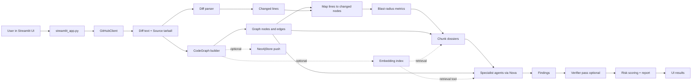
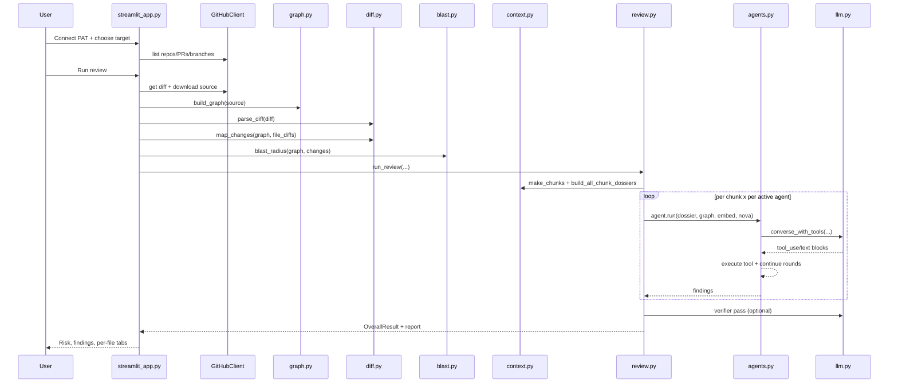

# PR Review System - Architecture and Workflow

## 1) Purpose

This project is a context-aware pull request review system.

It combines:
- GitHub PR/branch diff ingestion
- Multi-language static graph extraction (code knowledge graph)
- Blast radius and risk analysis
- Chunked context dossier generation
- Multi-agent LLM review (specialist agents)
- Optional evidence verifier pass
- Optional semantic retrieval (embeddings)
- Optional Neo4j graph persistence

Main goals:
- Review only changed code (+ lines in diff)
- Ground findings in local code evidence
- Prioritize high-risk changes
- Provide per-file and overall risk with actionable findings

---

## 2) Repository Structure

```text
claude-pr/
  streamlit_app.py                 # UI entrypoint and pipeline orchestration
  pr_review/
    __init__.py
    github_client.py               # GitHub API access, diff/tarball fetch
    graph.py                       # Multi-language code graph builder
    diff.py                        # Unified diff parsing and changed-line mapping
    blast.py                       # Blast radius and risk metrics
    context.py                     # Chunking and dossier construction
    embeddings.py                  # Local semantic embedding index (optional)
    agents.py                      # Specialist agent definitions + tool loop
    llm.py                         # AWS Bedrock Nova client + JSON extraction
    review.py                      # Review orchestration, verifier, scoring, report
    neo4j_store.py                 # Optional graph persistence/query helper
    eval.py                        # Offline evaluation harness
    requirements.txt               # Dependencies
```

---

## 3) High-Level Runtime Architecture



---

## 4) Main Execution Flow (End-to-End)

### 4.1 UI session setup
Handled in `streamlit_app.py`:
- Initializes Streamlit page and session state.
- Accepts GitHub PAT and review options.
- Supports two review targets:
  - Pull request mode
  - Compare branches mode

Session state holds:
- authenticated GitHub client
- selected repo data
- overall result object
- markdown report text
- built dossier text
- graph cache

### 4.2 GitHub connectivity and target selection
Through `pr_review/github_client.py`:
- `whoami()`, `list_repos()`, `list_branches()`, `list_pulls()`
- `get_pr_diff()` for PR mode
- `compare_diff()` for branch compare mode
- `download_source()` to fetch source tarball at selected ref

### 4.3 Graph build and caching
From `pr_review/graph.py`:
- Builds a directed graph (`networkx.DiGraph`) over repository code.
- Creates nodes for:
  - file, function, method, class, route, table, event
- Creates edges for:
  - defines, calls, imports, inherits, overrides, decorates, instantiates
- Supports languages by extension:
  - Python, JavaScript, TypeScript, Java, Go
- Uses tree-sitter where available; Python logic includes framework-aware patterns.

In UI pipeline:
- Graph is cached in `ss.graph_cache` keyed by head ref.
- Cache stores `(CodeGraph, EmbeddingIndex|None)`.

### 4.4 Diff parse and changed-node mapping
From `pr_review/diff.py`:
- Parses unified diff hunks.
- Tracks only added lines (`+` lines on new side).
- Maps added lines to innermost graph node by file/line.
- Classifies each changed node as:
  - `added`
  - `signature`
  - `behavior`

### 4.5 Blast radius and risk metrics
From `pr_review/blast.py`:
- Computes impacted callers/callees via BFS over relevant edge types.
- Computes covering tests using reverse traversal and naming heuristics.
- Uses sensitivity regex and node kind to adapt traversal depth.
- Produces metrics such as:
  - changed_nodes
  - total_fan_in
  - impacted_callers
  - sensitive_changes
  - changes_without_tests

### 4.6 Dossier generation
From `pr_review/context.py`:
- Splits each file's added lines into proximity chunks.
- For each chunk, assembles a focused dossier containing:
  - added line context
  - enclosing changed definitions
  - direct callers/callees
  - covering tests
  - optional semantic similar patterns
  - indirect callers
- Also supports combined whole-PR dossier.

### 4.7 Review execution
From `pr_review/review.py`:
- For each changed file:
  1. Make chunks
  2. Build per-chunk dossiers
  3. Run active specialist agents per chunk
  4. Merge candidates
  5. Optional verifier pass
  6. Deduplicate
  7. Compute per-file risk
- Produces overall result:
  - per-file findings
  - aggregated findings
  - risk score and level
  - total dropped by verifier
  - token estimate

### 4.8 LLM specialist agents
From `pr_review/agents.py` and `pr_review/llm.py`:
- Active agents can include:
  - Security
  - Correctness
  - Performance
  - API/DB Contract
  - Test Coverage
  - Architecture
- Each agent runs an agentic tool loop (max rounds), with tools like:
  - `get_callers`
  - `get_callees`
  - `get_source`
  - `find_similar`
  - `get_routes`
  - `get_tables`
- Findings must conform to strict JSON schema.

### 4.9 Optional verifier pass
In `review.py`:
- Second LLM pass checks whether candidate findings are actually supported.
- Invalid/unsupported findings are dropped.
- Drop count shown in per-file and global metrics.

### 4.10 UI rendering
In `streamlit_app.py`:
- Displays overall risk banner and metrics.
- Displays per-file tabs with risk and findings.
- Displays chunk-level breakdown.
- Supports dossier-only mode where no LLM review is run.

---

## 5) Core Data Contracts

### 5.1 Diff-layer data
- `FileDiff`
  - path, is_new, is_deleted
  - added_lines (set of + line numbers)
- `ChangedNode`
  - node_id
  - change_type
  - lines
  - file_path

### 5.2 Blast-layer data
- `Impact`
  - callers
  - callees
  - tests
  - inheritors
- `BlastResult`
  - per_change map
  - aggregate metrics

### 5.3 Review-layer data
- `Finding`
  - category, severity, file, line
  - title, explanation, evidence, recommendation
- `ChunkReviewResult`
- `FileReviewResult`
- `OverallResult`

---

## 6) Processing Modes

### 6.1 Full review mode
- Builds graph
- Parses and maps diff
- Computes blast radius
- Builds chunk dossiers
- Runs selected agents
- Optionally verifies findings
- Renders structured report

### 6.2 Dossier-only mode
- Builds graph and blast data
- Builds dossier text only
- Skips Nova/agent calls
- Useful for debugging or low-cost context inspection

### 6.3 Optional semantic mode
- If enabled and available, builds embedding index (`sentence-transformers`)
- Uses similarity results in dossier construction and agent tools

### 6.4 Optional Neo4j mode
- Pushes in-memory graph to Neo4j for persistence/cross-PR analysis

---

## 7) External Integrations

### 7.1 GitHub REST
- Auth via PAT
- Repository, branch, PR listing
- Diff retrieval
- Tarball download

### 7.2 AWS Bedrock Nova
- Primary LLM backend for:
  - specialist agents
  - verifier pass
  - eval harness judge

### 7.3 Neo4j (optional)
- Graph persistence and Cypher querying

### 7.4 Sentence Transformers (optional)
- Local embedding model for semantic retrieval

---

## 8) Sequence Diagram



---

## 9) Risk Scoring Model (Current)

Risk is composed from:
- impacted callers (capped)
- fan-in (capped)
- sensitive change count
- changes without tests
- severity weights from findings

Severity weights:
- critical: 10
- high: 6
- medium: 3
- low: 1
- info: 0

Risk levels:
- low (<25)
- medium (<55)
- high (<80)
- critical (>=80)

---

## 10) Evaluation Harness

From `pr_review/eval.py`:
- Runs the same pipeline over labeled evaluation cases.
- Compares actual findings against expected findings using an LLM judge.
- Tracks:
  - TP, FP, FN
  - precision, recall, noise
  - latency and token estimates
- Produces case-wise and macro summary.

---

## 11) Dependencies

From `pr_review/requirements.txt`:
- Core: `networkx`, `requests`, `boto3`, `streamlit`
- Parsing: `tree-sitter` and language grammars
- Semantic retrieval: `sentence-transformers`, `numpy`
- Optional graph DB: `neo4j`

---

## 12) Operational Notes

- The UI script inserts the app root into `sys.path`, allowing package imports even when launched from a different working directory.
- Diff analysis intentionally focuses on added lines to keep findings grounded on new code.
- Graph caching avoids repeated expensive graph builds for same selected head ref.
- Verifier can reduce hallucinated findings at the cost of additional LLM calls.

---

## 13) Typical Runtime Path (Quick Summary)

1. User authenticates with GitHub PAT.
2. User selects PR or branch comparison target.
3. App fetches diff and source tarball.
4. App builds code graph.
5. App maps added lines to changed graph nodes.
6. App computes blast radius and base risk metrics.
7. App builds chunk-level dossiers.
8. App runs selected specialist agents.
9. App optionally verifies findings.
10. App deduplicates, scores risk, renders full report.

---

## 14) Extension Points

- Add new specialist agents in `pr_review/agents.py`.
- Add new graph extractors/languages in `pr_review/graph.py`.
- Tune chunking and dossier token budgets in `pr_review/context.py`.
- Adjust risk model in `pr_review/review.py`.
- Expand evaluation cases in `pr_review/eval.py`.

---

## 15) Suggested Future Hardening

- Cache key refinement to avoid stale graph reuse across moving branch refs.
- Stronger archive extraction safety checks in `github_client.py`.
- Preserve TLS verification for GitHub requests.
- Add automated tests for:
  - diff parsing
  - change mapping
  - blast radius logic
  - verifier behavior
  - end-to-end pipeline smoke tests
